# CacheQuant (Faster GPT-2 on CPU)

This is a learning / experiment project. I don't have a GPU, only a CPU
(Intel i7-8700K). The question: with what I have, can I run GPT-2 small faster?

What I worked with:

- **Regular CPU, no GPU**: Intel i7-8700K, 12 threads. 8 threads pinned for
  every run.
- **No native fp16**: the chip converts fp16 <-> fp32, but every fp16 multiply
  still happens in fp32 underneath.
- **Pinned versions**: torch 2.13, transformers 5.14, numpy 2.4, numba 0.66,
  Python 3.14.
- **GPT-2 small (124M params)**, running fully on CPU.
- **Pricing**: AWS `c7i.2xlarge` (8 vCPU) at $0.357/hr, used as a reference
  number only.

In this project I use two optimizations:

1. **Quantization**: do the matrix multiplies in int8 instead of fp32. Fewer
   bytes to move, cheaper math.
2. **Prefix reuse cache**: reuse the attention (KV) cache across requests that
   share a prefix, so the model doesn't recompute text it has already seen.

Every number here is measured on my machine. The point is to
understand *why* each optimization helps or hurts, with from-scratch
implementations.

## Baseline: plain fp32 GPT-2 on CPU

A clean generation loop with prefill and decode timed **separately**.
One discarded warmup, then 5 timed reps, report the median.
First run pays one-time setup costs (loading code onto the GPU, sizing memory), so drop it so timings reflect steady-state work, not startup.
Prefill recomputed fresh every request. 

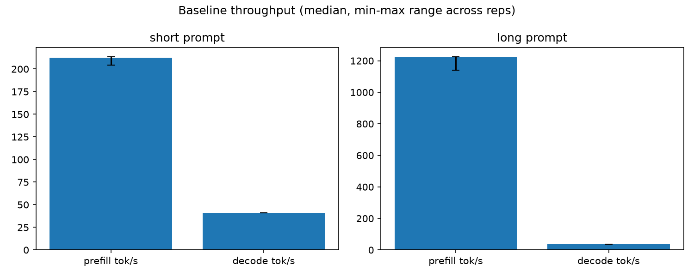

- On the short profile (8-token prompt, 50 generated tokens) prefill is ~5x faster
per token than decode.

- The fp32 numbers themselves (216 tok/s prefill, 41 tok/s decode, $0.00244 / 1K) are the 100%
reference row in the quantization table below.

## Optimization 1 - Quantization

This optimization make each matrix multiply cheaper by compressing weights and activations from 32-bit floats down to smaller numbers.

Why 8 bits, not 4? On this CPU int8 multiply-accumulate is a native instruction and int4 is not.

Quantized layers: attention Q/K/V projection, attention output projection, both
feed-forward linears. Token embedding and `lm_head` stay fp32 (lookups /
accuracy-critical, not the bottleneck).

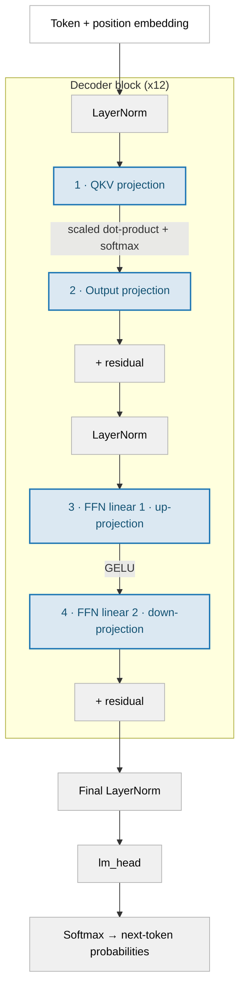

Legend:

- **Quantized linear (INT8)** - the four blue nodes (QKV, output, FFN up, FFN down); 4 per block x 12 = 48 total
- **fp32 - kept exact** - norms, residuals, final norm, `lm_head`, softmax
- **Lookup / no matmul** - token + position embedding

Two schemes are built and run side by side. They share the **same** Numba-JIT
int8×int8→int32 matmul kernel (`cachequant/kernel/blocked_matmul.py`) and differ
in exactly one thing - **how the scale is chosen**:

| | scale granularity | scale value |
|---|---|---|
| **BFP8** (block floating point) | one per 32 values | `2**ceil(log2(max_abs))` (rounded up to a power of two) |
| **plain int8** | one per row (output channel for a weight, token for an activation) | `max_abs`, exactly |

### BFP8 - one shared exponent per 32-value block

Take a block, say `fp32: 1.5, -0.7, 0.2, -1.9`. The scale is the block's max
magnitude rounded **up** to a power of two:

$$\text{scale} = 2^{\lceil \log_2 (\max |x|) \rceil}$$

Here $\max|x| = 1.9$, so $\text{scale} = 2^{\lceil \log_2 1.9 \rceil} = 2^1 = 2$.
Quantize, then dequantize, each value:

$$m = \text{round}\left(\frac{x}{\text{scale}} \cdot 127\right) \qquad\qquad \hat{x} = \frac{m \cdot \text{scale}}{127}$$

e.g. $x = 1.5 \Rightarrow m = \text{round}(1.5 / 2 \cdot 127) = 95 \Rightarrow \hat{x} = 95 \cdot 2 / 127 = 1.496$ (was 1.5, close enough).

**Cost per value:** $8 + \dfrac{8}{32} = 8.25$ bits - int8 mantissa plus one 8-bit
exponent shared across 32 values. (fp32 is 32.)

### plain int8 - one exact scale per row

Same quantize / dequantize maths, two changes: the scale covers a whole **row**
(768 values, not 32), and it is **not** rounded to a power of two.

$$\text{scale} = \max_i |x_i| \quad (\text{exact, not rounded to a power of two})$$

$$m = \text{round}\left(\frac{x}{\text{scale}} \cdot 127\right) \qquad \hat{x} = \frac{m \cdot \text{scale}}{127}$$

**Cost per value:** $8 + \dfrac{32}{768} \approx 8.04$ bits - int8 mantissa plus one
fp32 scale amortized over the row. Slightly cheaper than BFP8's 8.25.

**Trade-off:**
- Upside: no wasted range - full use of every bit.
- Downside: one outlier now drags down precision for the entire row, not just a small 32-number group

### Quantization Results: Compression vs. Speed

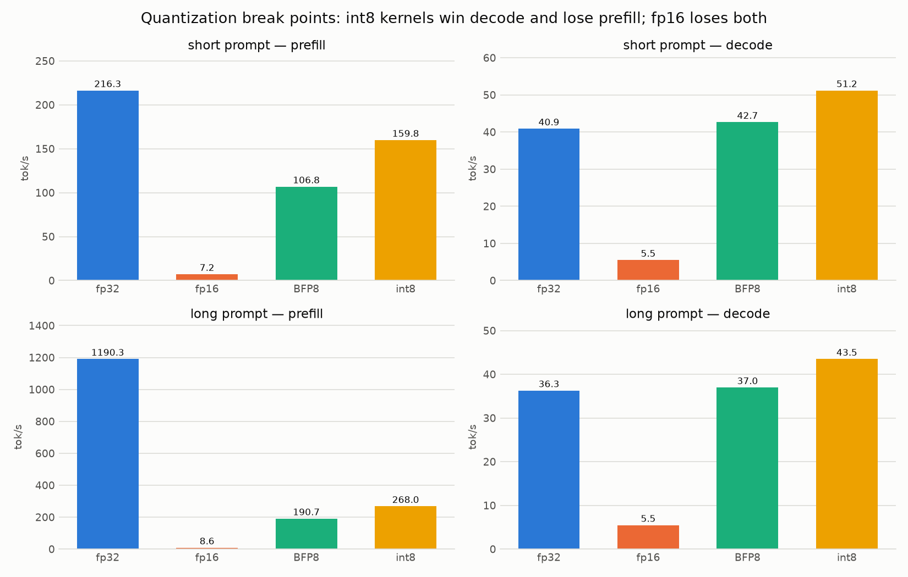

Short prompt, 50 tokens (% vs fp32):

| scheme | prefill tok/s | decode tok/s | cost / 1K |
|---|---:|---:|---:|
| fp32 | 216.3 (100%) | 40.9 (100%) | $0.00244 |
| fp16 | 7.2 (3%) | 5.5 (13%) | $0.01960 (8.0x) |
| BFP8 | 106.8 (49%) | 42.7 (104%) | $0.00241 (0.99x) |
| **int8** | **159.8 (74%)** | **51.2 (125%)** | **$0.00198 (0.81x)** |

**Two headline findings:**

1. **Quantization always loses at prefill** (49% / 74% of fp32). Prefill is
   compute-bound and a readable `@njit` triple loop cannot follow Intel MKL's
   hand-tuned vectorized fp32 kernels.
2. **Quantization wins at decode** (104% / 125% of fp32), int8 by a solid
   margin. Decode is a matrix-*vector* product limited by weight bytes read from
   RAM; int8 mantissas are ~4x smaller than fp32 weights.

Net effect on the decode-heavy short profile: **int8 is the first configuration
in the project to beat fp32 on cost** - $0.00198 vs $0.00244 (0.81x). On the
prefill-heavy long profile it still loses (2.55x), because slow prefill
dominates the wall clock there.

### Why those results

**Prefill is compute-bound.** It reads the whole prompt in one big batched
matmul: each weight is loaded from RAM once, then multiplied against every prompt
token - lots of math per byte moved. The int8 kernel is a readable triple loop
compiled by Numba; it can't match Intel MKL's hand-tuned vectorized fp32
kernels, so it's expected to lose here.

**Decode is memory-bandwidth-bound.** The time goes to reading the weights from
RAM. int8 mantissas are ~4x smaller than fp32 weights → ~4x less to read →
faster.

**The fp16 experiment.** This CPU has no native fp16 multiplier - every fp16 op
unpacks to fp32, computes, repacks. Fewer bytes moved, but still slower.

**Takeaway:** shrinking numbers only helps if the hardware can actually compute
with the shrunk format directly. int8 works because the CPU's instruction set
has a built-in multiply-and-add for 8-bit integers.

### BFP8 vs int8: quality and kernel cost

**Quality is a tie.** 3-passage perplexity (`eval/passages.py`): fp32 39.86 ·
BFP8 40.01 (+0.38%) · int8 39.99 (+0.34%). The 0.04pp gap is below what a
3-passage eval can resolve.

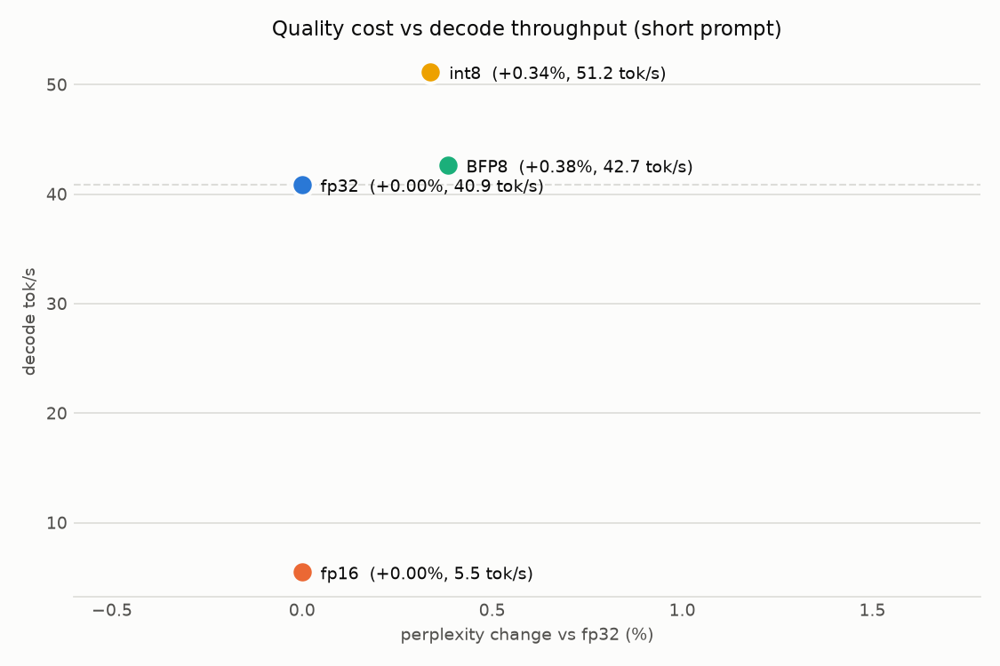

**Why they tie** - fill in the two corners neither scheme ships:

| granularity | scale | bits/value | perplexity | Δ vs fp32 |
|---|---|---:|---:|---:|
| block-32 | pow2 - **BFP8** | 8.250 | 40.012 | +0.38% |
| block-32 | exact | 9.000 | 39.826 | −0.08% |
| per-channel | pow2 | 8.010 | 40.930 | +2.68% |
| per-channel | exact - **int8** | 8.042 | 39.994 | +0.34% |

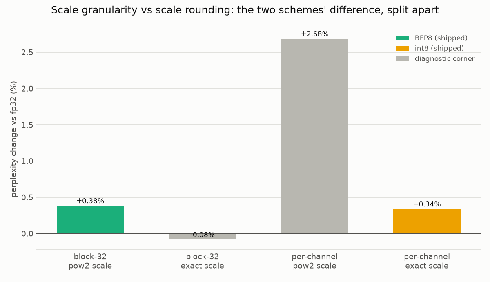

The **rounding axis** (pow2 → exact) costs far more than the granularity axis.
BFP8 sits on the wrong side of it, which is how int8 - a 24x coarser scale -
ties it. One real difference the perplexity tie hides: **BFP8 greedy output is
token-identical to fp32**; int8 stays coherent but diverges. A real ranking
needs a WikiText-2-scale eval, not 3 passages (`TODO.md`).

**Kernel cost:** int8 runs **~1.5x faster** per layer - BFP8 does `K/32` scale
multiplies per output element (24–96 at GPT-2 sizes) where int8 does one.

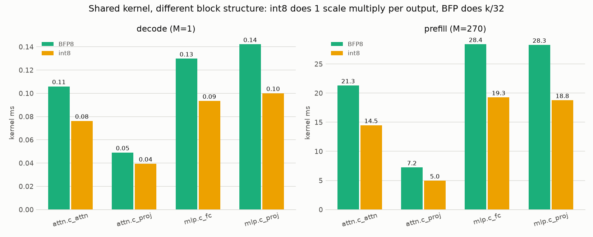

## Optimization 2 - Reusing the KV cache across requests

"KV cache" means three things. This project is the third:

1. **Decode KV cache** (within one generation) - universal, always on, not this.
2. **Continuous batching** (many requests packed together) - not this, batch 1.
3. **Cross-request prefix reuse (this project)** - when a *new* request begins with the same
   tokens as an earlier one, reuse the earlier request's K/V for the shared
   prefix.

`PrefixKVCache` (`cachequant/kvcache/`) is a token-level **trie**: each node is
one token position holding that position's per-layer K/V (12 layers × K/V = 24
tensors per token), with LRU eviction capped at 2048 tokens. On a new request:
find the longest cached prefix, reuse its K/V, run a forward pass on **only the
uncached suffix**, insert the new K/V back.

Two hard limits:

- The **last prompt token is always recomputed** (next-token logits need a fresh
  forward pass there), so max hit rate is `(N-1)/N`, never 1.
- The cache has a fixed overhead `O` (lookup + copy K/V + insert). It only pays
  when `hit_rate × prompt_tokens × per_token_prefill_cost > O`.

### How the trie grows: "The cat sat ..."

**Request A - `"The cat sat"`.** Cache is empty. `lookup` misses on the first
token, so the forward pass runs all 3 tokens, then `insert` writes one node per
token - a straight chain off the root.

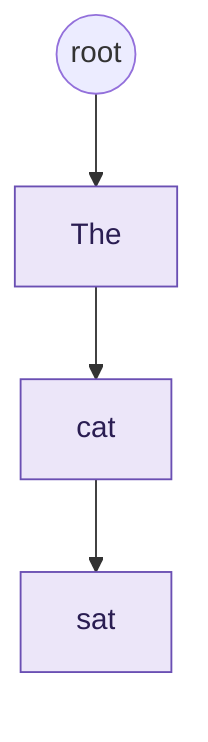

**Request B - `"The cat sat on the mat"`.** `lookup` walks `The -> cat -> sat`,
all cached (green), then stops - `sat` has no `on` child yet. `matched_len = 3`.
The forward pass runs only `on the mat`; `insert` extends the same chain. The
last token (`mat`) is always recomputed, so it is never even looked up.

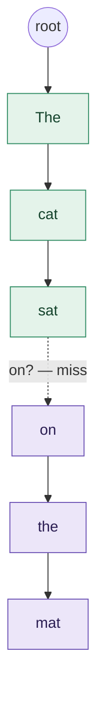

**Request C - `"The cat sat near a lake"`.** Same trunk reused
(`matched_len = 3` again), but `sat` has no `near` child, so `insert` adds a
**second branch**. `sat` now has two children. This is the whole point of a trie
over a flat list: every prompt starting `"The cat sat ..."` reuses the trunk, no
matter how it continues.

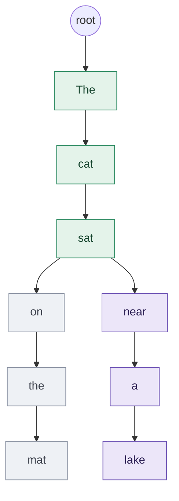

### What one node holds

A node is a single **token position**. Inside it: one `(K, V)` pair per
transformer layer - 12 layers, so 24 tensors. Each K (and each V) is that one
token's key (value) across all 12 attention heads: `[12 heads x 64 dim]` = 768
fp32 values. That is the ~86 KB/token in the Limitations section.

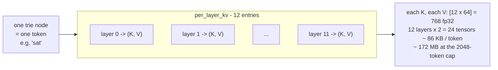

### One-shot results: mostly nothing

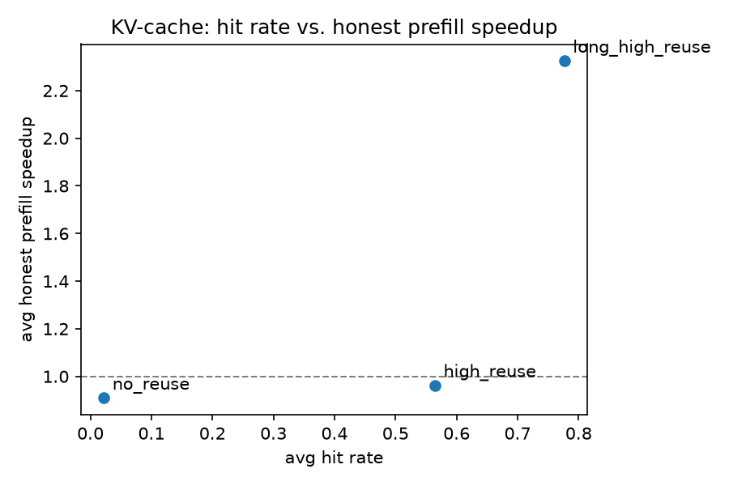

Three prompt sets, "honest" speedup = cache overhead included:

| set | hit rate | speedup |
|---|---:|---:|
| `high_reuse` (~12-token shared preamble) | ~0.57 | **0.96x** (noise, no real win) |
| `long_high_reuse` (~280-token shared preamble) | ~0.78 | **2.4x** |
| `no_reuse` (independent prompts) | ~0.02 | **0.90x** (a ~9% tax) |

`high_reuse` is flat because the ~12-token shared prefix is cheaper to encode
than the cache's own bookkeeping. `no_reuse` shows the downside honestly: with
nothing shared, every request still pays a failed lookup and a useless insert.
**The cache is a bet on the workload.**

### Multi-turn chat (the use case)

A conversation re-sends the whole transcript every turn plus one new line, so the
reusable prefix grows with it. The trie already keys on the token prefix, so this
needed **zero new caching code**.

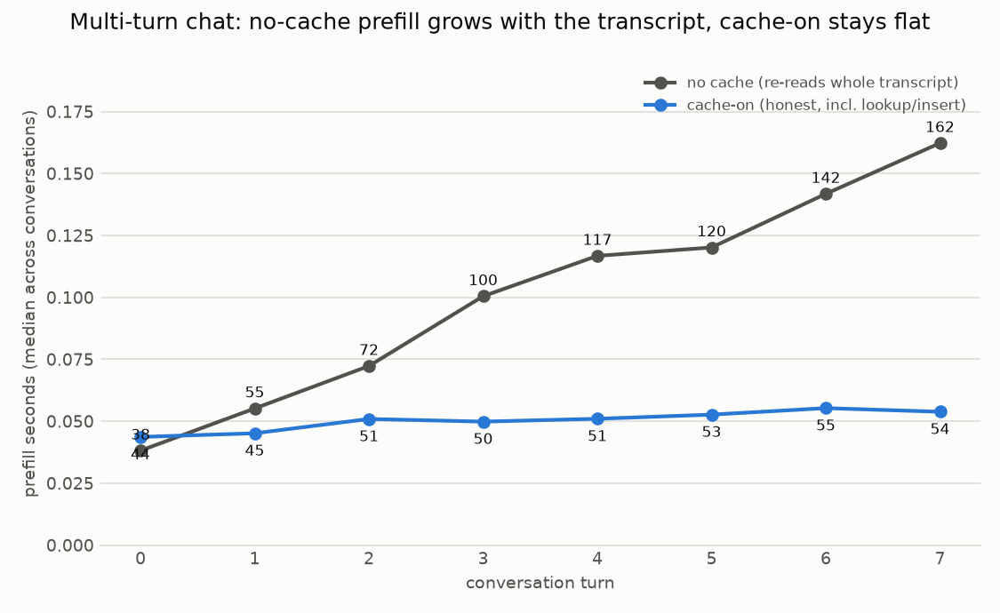

Median per turn. 3 conversations (2 short system prompt, 1 with a ~280-token
system prompt), 8 turns each, 5 reps.

| turn | no-cache prefill | cache-on (honest) | hit rate | speedup |
|---:|---:|---:|---:|---:|
| 0 (cold) | 38 ms | 44 ms | 0.00 | 0.87x |
| 1 | 55 ms | 45 ms | 0.53 | 1.22x |
| 3 | 100 ms | 50 ms | 0.75 | 2.02x |
| 5 | 120 ms | 53 ms | 0.84 | 2.28x |
| 7 | 162 ms | 54 ms | 0.87 | **3.01x** |

- Turn 0 loses slightly (0.87x) - nothing to reuse yet, still pays the storage cost.
- Every turn after, the win grows: without cache, time climbs (38 ms → 162 ms) as
  the conversation lengthens; with cache it stays roughly flat (~50 ms).
- By turn 7, cached chat is **3x faster** than uncached.

## Both optimizations together

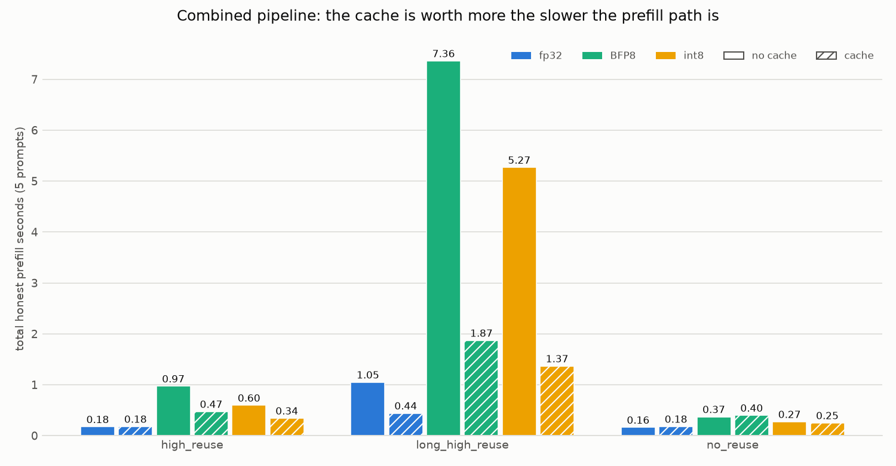

`{fp32, BFP8, int8} × {cache, no cache} × 3 prompt sets`, metric = total honest
prefill seconds.

- **Cache behaviour is the same regardless of compression** - hit rates are
  identical across schemes (0.565 / 0.777 / 0.022).
- **The two optimizations are independent in performance** - quantization is a
  decode/cost win, the cache a prefill win on repetitive workloads. They stack;
  neither fixes the other's weak spot.

## Setup

Requires **Python 3.14** (the only version tested).

```bash
python3 -m venv .venv
source .venv/bin/activate
pip install -r requirements.txt
pip install -e .
```

Pinned: `torch==2.13.0`, `transformers==5.14.1`, `numpy==2.4.6`,
`numba==0.66.0`, `pytest==9.1.1`. (`numpy` is held below 2.5 because
`numba==0.66.0` requires it.)

## How to run

```bash
# Tests
pytest -v                    # fast, no network
pytest -m integration -v     # loads real GPT-2 weights (~500MB on first run)

# Baseline
python scripts/run_baseline.py            # writes benchmarks/baseline_results*.json
python scripts/plot_baseline.py           # re-plot only

# Quantization
python scripts/run_bfp_benchmark.py               # BFP8 speed vs baseline
python scripts/run_int8_benchmark.py              # int8 speed, same harness
python scripts/run_fp16_benchmark.py             # fp16 reference point
python scripts/compare_quantization_quality.py   # fp32 vs BFP8 vs int8 perplexity + grid
python scripts/profile_kernel_breakdown.py       # per-stage timing, both schemes

# KV cache
python scripts/run_kvcache_benchmark.py     # one-shot hit rate vs speedup
python scripts/run_multiturn_benchmark.py   # prefill cost per turn

# Combined + charts
python scripts/run_combined_benchmark.py             # all toggle states
python scripts/export_slide_charts.py                # re-run every benchmark, then plot
python scripts/export_slide_charts.py --charts-only  # re-plot from existing JSON

# Live demo
streamlit run cachequant/dashboard/app.py --server.address 127.0.0.1
```

## Limitations

- Storage is heavy: each cached word takes ~86KB (12 layers × K/V pairs) ->
  ~172 MB at the 2048-token cap.
- Eviction scan is O(n): walk the whole trie per evicted node -> wouldn't scale
  to a large production cache.
- Every cache hit copies the matched data into a fresh block of memory - a small
  but real cost per request (~8ms for a long shared prefix).
- On workloads with no shared text, the cache still costs ~9% - pure overhead.
- The multi-turn benchmark never triggers eviction (longest transcript 489
  tokens vs the 2048 cap). Eviction isn't implemented yet.
- int8 + cache interaction: int8 compression's exact scale is sensitive to tiny
  rounding differences, so an int8 answer served from cache can occasionally
  differ. Not a quality problem, just a reproducibility quirk. BFP8 doesn't have
  this issue.
- Quality eval is only 3 passages (`eval/passages.py`). The BFP8-vs-int8 gap
  (0.04pp) is under what it can resolve - a real ranking needs a WikiText-2-scale
  eval. Tracked in `TODO.md`.

## Conclusion

Two bottlenecks, two optimizations, no overlap.

- **Decode is memory-bound → quantization wins.** int8 weights are ~4x smaller,
  so ~4x less to read from RAM → ~1.25x decode throughput. No precondition; it
  helps every request.
- **Prefill is compute-bound → prefix reuse wins.** Skipping the shared prefix
  entirely buys ~3-6x prefill in multi-turn chat. But it needs actual reuse - on
  workloads with no shared text it's a ~9% tax.

Each optimization has its own limitations. Quantization's plain triple-loop kernel is
still slower at prefill than the Intel Math Kernel Library (MKL) fp32 kernels
PyTorch normally uses, so it only pays off at decode. The cache's payoff depends
on the workload - it only wins when requests share a long prefix, and costs a
~9% tax when they don't - and the trie itself (one node per token, O(n)
eviction, fat storage) is a toy design, not a production cache.

